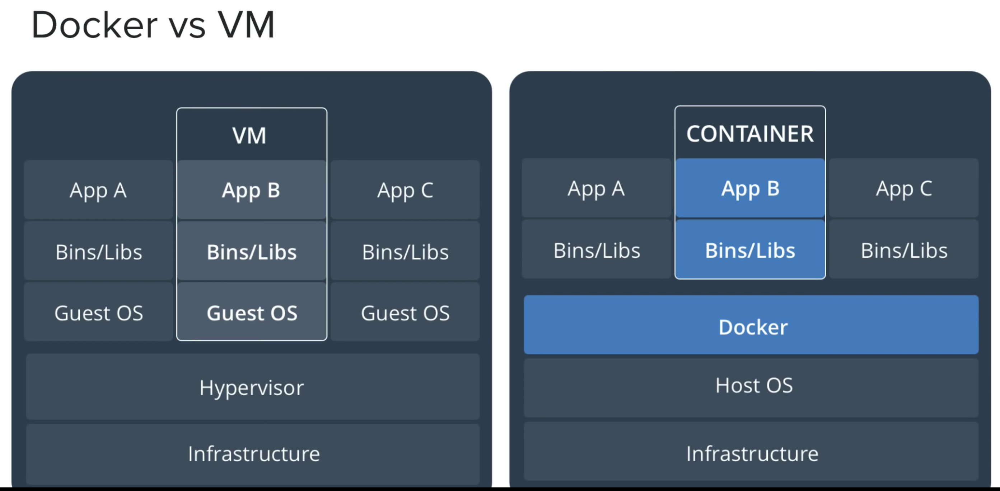

# Docker

Docket Command

```
brew cask install docker       # Install Docker
open /Applications/Docker.app  # Start Docker
```

```
RUN 

#List contains
docker ps
doctor ps -a

#Start a container
docker run redis
docker run redis:tag

#Start a container with append
docker run redis sleep 5

#Start a container
docker start <<container_id>>

#Stop a container
docker stop redis

#Remove a container
docker rm redis

#List Images
docker images

#Remove Images
docker rmi redis

#Download Image
docker pull redis

#Attach and Detach 
docker run -d redis
docker attach <<id>>

#Standard input
docker run -it dochub/cliapp

#Port Mapping
docker run -p 5000:5000 dochub/webapp

#Volume Mappping
docker run -v /opt/datadir:/var/lib/mysql mysql

#Inspect Container
docker inspect redis 
docker inspect <<id>>

#Container log
docker logs <<id>>
```

```
Redis Example:
docker run --name redisdb -p 6379:6379 redis
docker exec -it redisdb redis-cli
```

```
#Envionment Variable
docker run -e app_var=somevar someDocApp
```

```
#CMD vs Entrypoint
In docker file, CMD can be found as below:
ex: https://github.com/tianon/docker-brew-ubuntu-core/blob/5510699c08fd4c68c7fd05783ceedf15751b6cd9/bionic/Dockerfile
CMD ["/bin/bash"]

example:
CMD sleep 10
or
CMD ["command","param1"] e.g. CMD ["sleep","10"] 

ENTRYPOINT ["sleep"]
so, parmeter provided to run on the command line will be appened in enterpoint.

this can be overrided by --entrypoint
docker run --entrypoint newSleep someDocApp 
```

```
#Networking
docker network ls

Type of networks.
1) Bridge (Default)
    e.g. docker run ubuntu
    private internal network, and usually get host 172.17. series.
    You may also created separate isolated newwork using below:
    docker network create \
         --driver bridge \
         --subnet 182.19.0.0/16
         separate-isolated-newwork
    
2) None
    docker run ubuntu --network=none
    container are not attached to any network, so they are isolated.
    
3) Host
    docker run ubuntu --network=host
    can be access externally without port mapping
    
    
Embeded DNS
Always runs on 127.0.0.11
```

```
#Docker Storage
File System
```




.png>)
