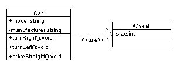

# UML Class Diagram

Class Visibility

```
Public (+)
Private (-)
Protected (#)
Package (~)
Derived (/)
Static (underlined)
```

.png>)



| 0         | No instances (rare)           |
| --------- | ----------------------------- |
| **0..1**  | No instances, or one instance |
| **1**     | Exactly one instance          |
| **1..1**  | Exactly one instance          |
| **0..\*** | Zero or more instances        |
| **\***    | Zero or more instances        |
| **1..\*** | One or more instances         |

[https://en.wikipedia.org/wiki/Class\_diagram](https://en.wikipedia.org/wiki/Class\_diagram)
